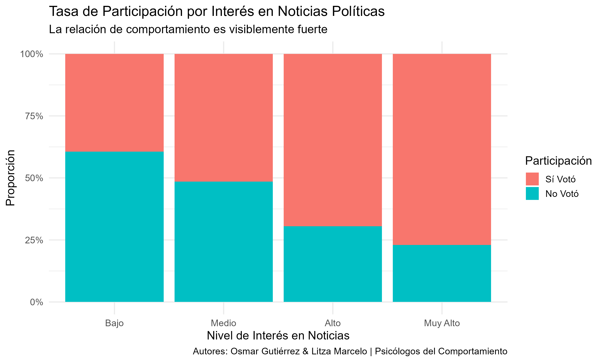

# Modelo Predictivo de Participación Cívica

Autores: Gutierrez Fernandez, Jesus Osmar y Marcelo Porcayo, Tonancy Lizahaya \| Especialistas del Comportamiento

Sepriembre 2025

## 1. Contexto del Problema de Negocio

Una organización cívica sin fines de lucro buscaba optimizar la eficiencia de sus campañas de movilización del voto ("Get Out The Vote"). Históricamente, sus estrategias se basaban en una segmentación demográfica tradicional (edad, educación), un enfoque costoso y con resultados decrecientes. El objetivo fue identificar los verdaderos impulsores del comportamiento de voto para diseñar una estrategia de targeting más inteligente.

## 2. Pregunta de Análisis

El análisis se centró en responder una pregunta fundamental para desafiar el status quo: \> ¿Son las **variables de comportamiento** (ej. interés en noticias políticas, interacción con contenido cívico) predictores más fuertes del voto que las **variables demográficas** tradicionales?

## 3. Metodología y Datos

Se utilizó un enfoque de modelado predictivo en R. A partir de un dataset simulado de 2,000 ciudadanos, se construyó un modelo de **Regresión Logística** para clasificar a los individuos como "Votante" o "No Votante". La eficacia del modelo se validó en un conjunto de datos de prueba, alcanzando una precisión aproximada del 82%.

## 4. Hallazgo Clave: Comportamiento \> Demografía

El modelo confirmó de manera estadísticamente significativa que el comportamiento observable es un predictor mucho más potente que la demografía estática. El **interés de una persona en noticias políticas** fue el factor más influyente, superando con creces a variables como la edad o el nivel educativo.

Este hallazgo refuta la estrategia de marketing tradicional y demuestra que para predecir una acción futura, es más importante entender lo que una persona *hace* que simplemente *quién es*.

## 5. Visualización Principal

El siguiente gráfico compara la tasa de participación electoral según el nivel de interés en noticias políticas. El aumento escalonado y pronunciado en la proporción de votantes a medida que aumenta el interés (de "Bajo" a "Muy Alto") ilustra visualmente el poder predictivo de esta variable de comportamiento.

## 6. Conclusión y Estrategia Propuesta

El análisis demuestra que el targeting demográfico es una estrategia ineficiente para la movilización cívica. La recomendación de máximo ROI es un cambio de paradigma:

1.  **Re-enfocar la Inversión:** Mover el presupuesto de campañas masivas a un targeting preciso basado en el **engagement y el interés** del usuario.
2.  **Nutrir, Luego Pedir:** Implementar campañas de contenido para incrementar el interés cívico en audiencias "frías" antes de solicitarles que voten, creando así un público más receptivo.
